# Manchester United — Omarchy theme

Live screenshots from this machine, including a new empty window and the usual Omarchy pages on the 2026/27 home-red / away-blue palette.

## Desktop

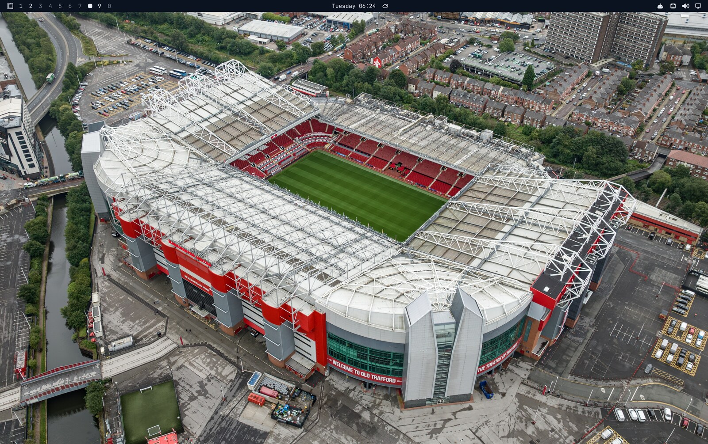

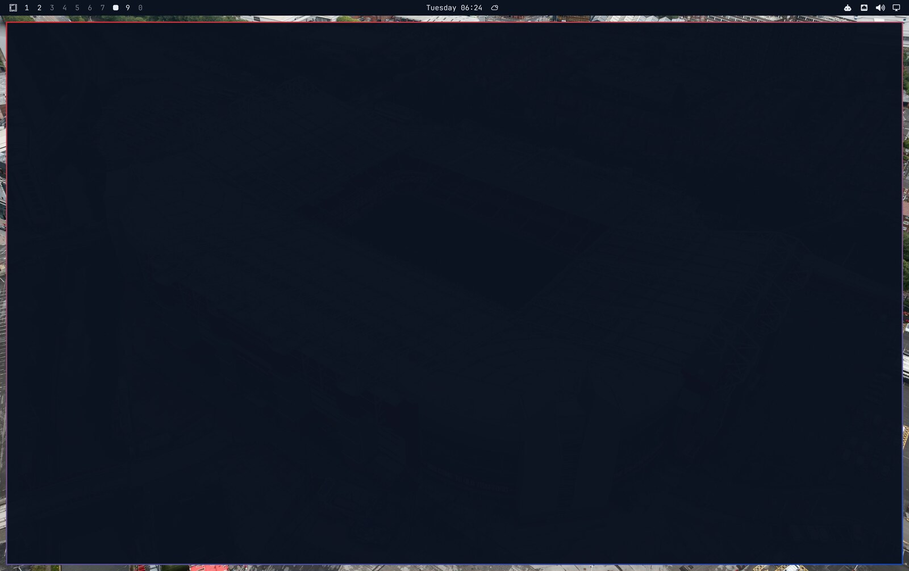

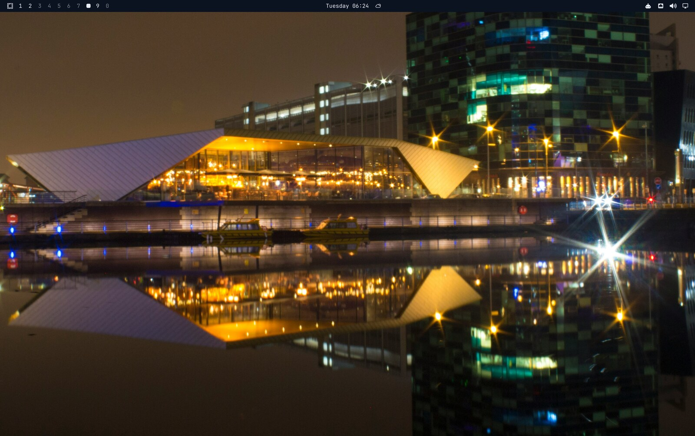

## Pages

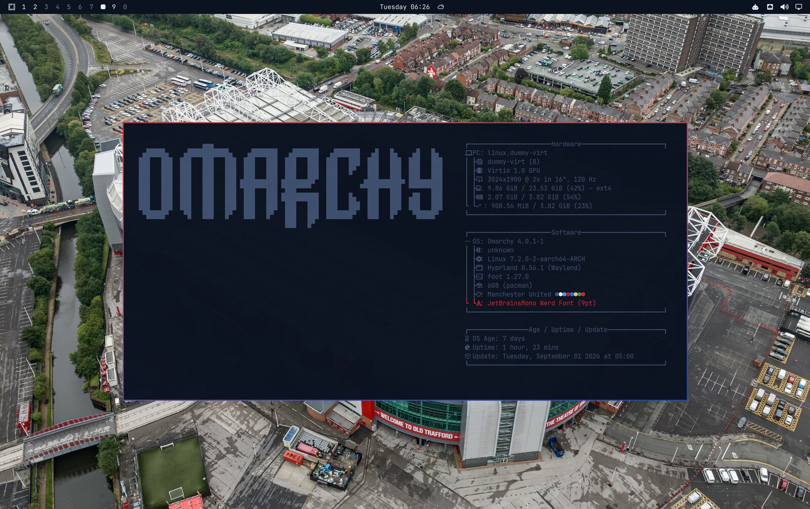

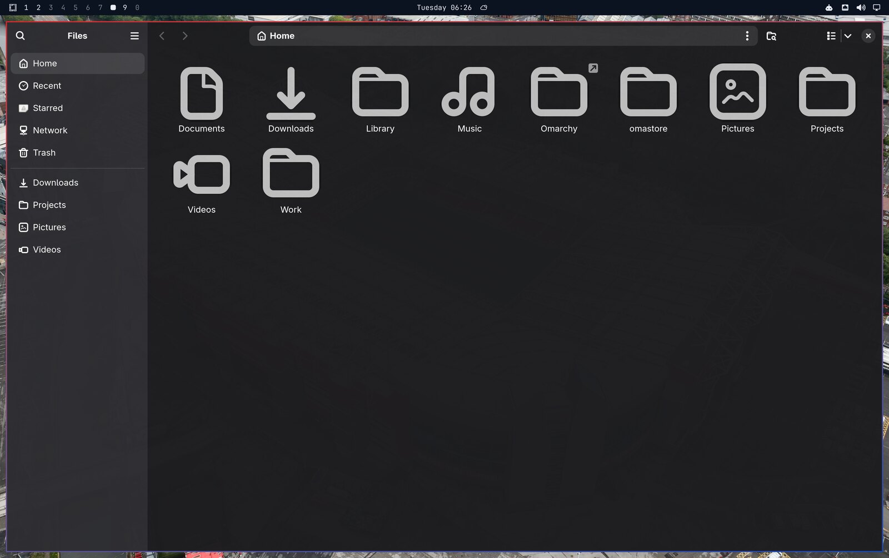

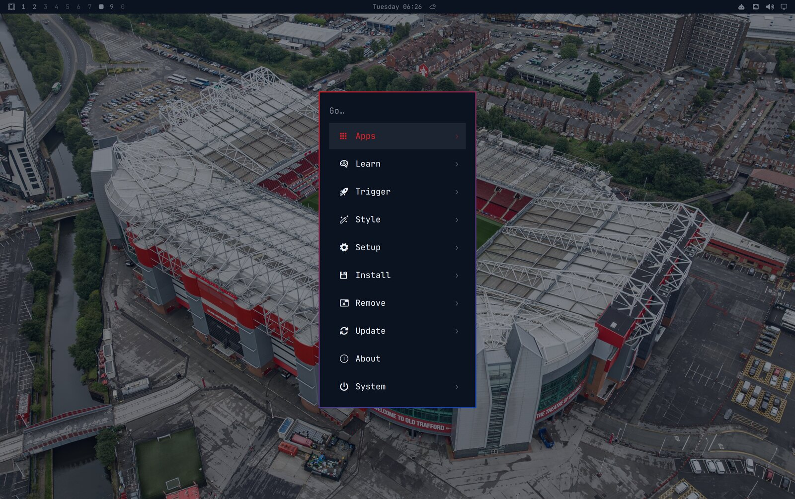

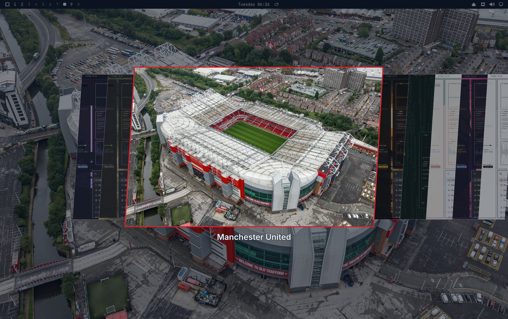

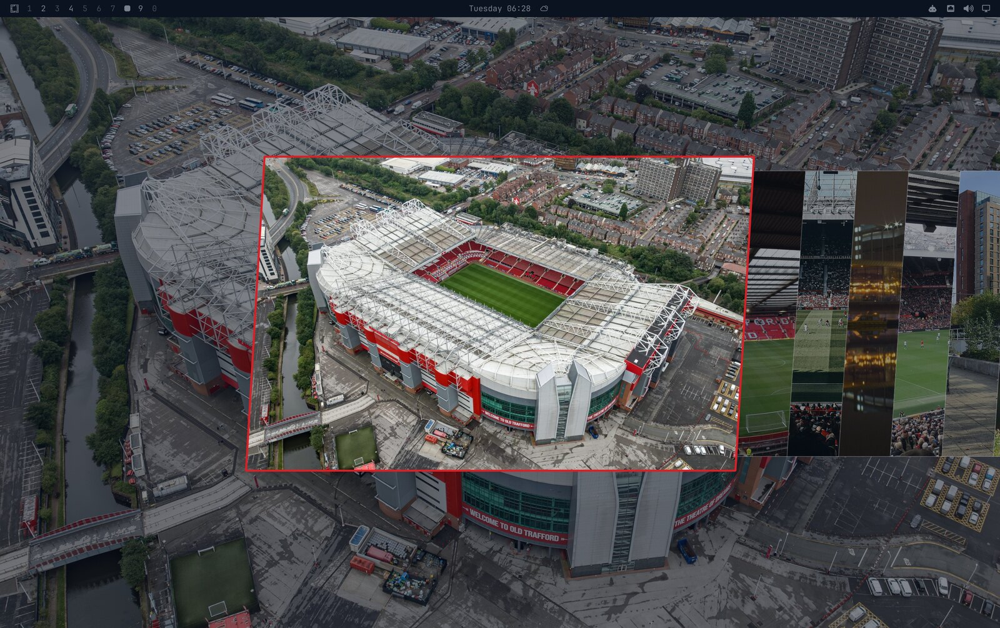

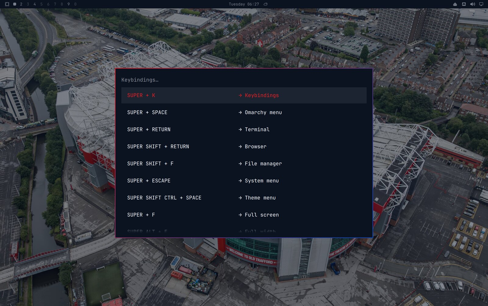

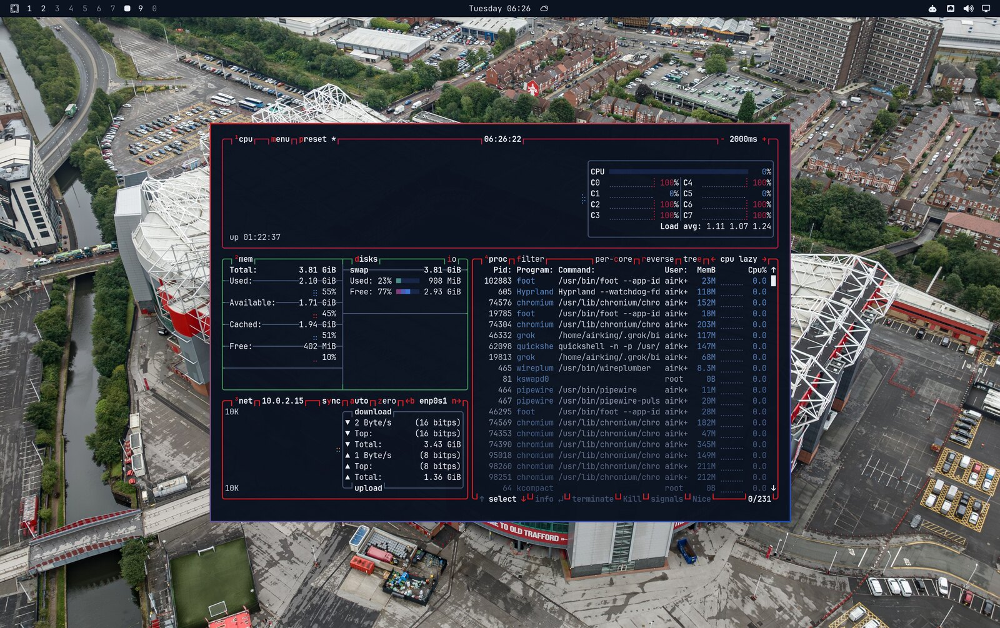

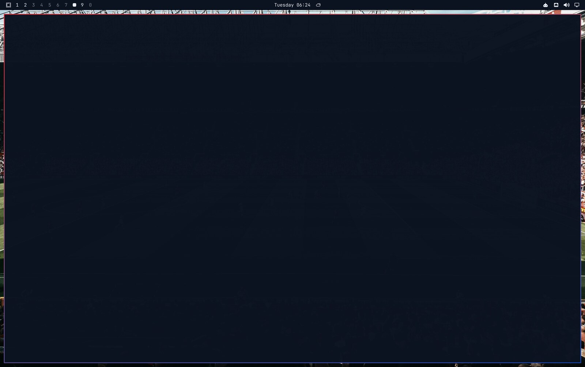

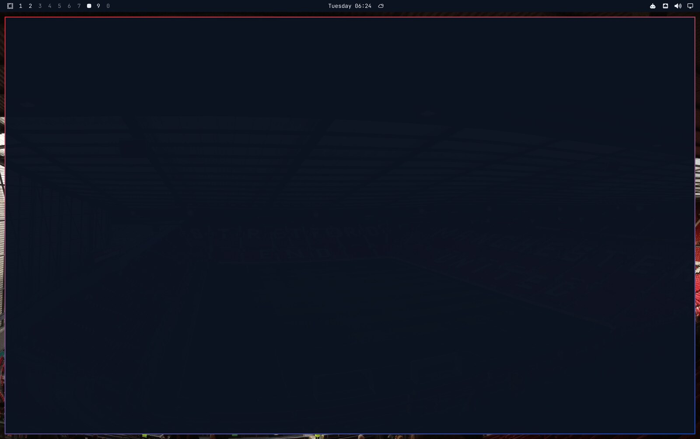

Private Omarchy theme mixing Manchester United's **2026/27 home red** (`#DC1F26`) with the **away royal blue** (`#0845BA`). Wallpapers are real 4K photographs of Old Trafford and Manchester. Window borders are a home-red → away-blue gradient.

## Install

```bash
omarchy theme install git@github.com:anujraja/omarchy-theme-manchester-united.git
omarchy theme set "Manchester United"
```

Screensaver wordmark (optional):

```bash
cp branding/screensaver.txt ~/.config/omarchy/branding/screensaver.txt
```

## Palette

| Token | Colour | Role |
| --- | --- | --- |
| Accent | `#DC1F26` | 26/27 home red |
| Blue | `#0845BA` | 26/27 away royal |
| Background | `#0B1220` | Night navy |
| Foreground | `#E9EEF6` | White kit trim |

## Wallpapers

All `3840×2160`:

- Old Trafford aerial — Arne Müseler, Wikimedia Commons
- Stretford End — Stacey MacNaught, Flickr / Wikimedia Commons
- Theatre of Dreams — Samuel Regan-Asante, Unsplash
- Salford Quays night — Unsplash
- Sir Alex corner — Wikimedia Commons
- Manchester canal — Geograph
- Sir Alex Stand — Geograph
